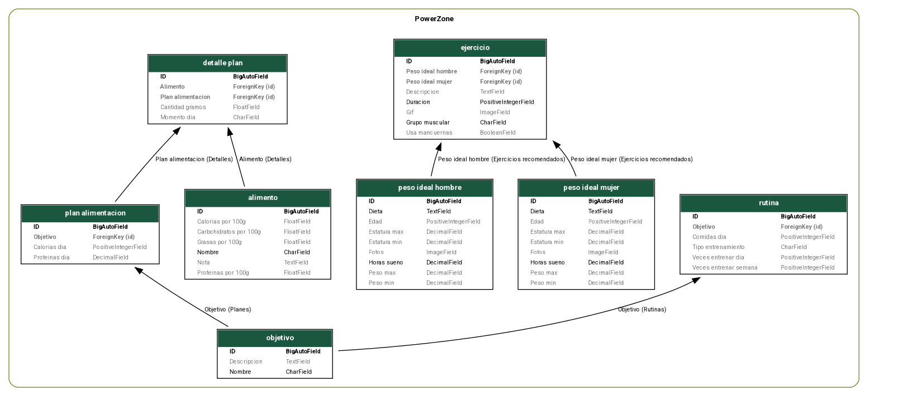

# PowerZone API

## Descripción

PowerZone es una API pública desarrollada en Django y Django REST Framework para la gestión de usuarios, rutinas de ejercicio, ejercicios, categorías, objetivos y planes de alimentación. Permite a los usuarios consultar, crear, modificar y eliminar información relacionada con el fitness y la nutrición.

---

## Instalación y configuración

### 1. Crear y activar el entorno virtual

En Windows:

```sh
python -m venv venv
venv\Scripts\activate
```

En Linux/Mac:

```sh
python3 -m venv venv
source venv/bin/activate
```

### 2. Crear proyecto Django

```sh
django-admin startproject homeFit
```
### 3. Crear aplicación Django

```sh
django-admin startapp PowerZone
```

### 4. Crear archivo `requirements.txt`
```bash
asgiref==3.8.1
Django==5.2.1 # versión estable de Django
django-extensions==4.1 #importante para generar el diagrama de modelos
sqlparse==0.5.3
tzdata==2025.2
djangorestframework==3.16.0 # para crear la API
```

### 5. Instalar dependencias

```sh
pip install -r requirements.txt
```

### 6. Configurar `settings.py`
En el archivo `settings.py`, agregar la aplicación `PowerZone`, `rest_framework` y `django_extensions` a la lista de `INSTALLED_APPS`:

```python
INSTALLED_APPS = [
    ...
    'PowerZone',
    'rest_framework',
    'django_extensions',
]
```

### 7. Migrar la base de datos

```sh
python manage.py makemigrations
python manage.py migrate
```

## Diagrama de modelos
Instalar Graphviz desde su [página oficial](https://graphviz.gitlab.io/download/) para generar el diagrama de modelos:

```sh
sudo apt-get install graphviz
```

El diagrama de modelos se genera con el comando:

```sh
python manage.py graph_models PowerZone -o diagrama.png
```



---

### Ejecutar el servidor

```sh
python manage.py runserver
```

---

## Endpoints de la API

Todos los endpoints están bajo el prefijo `/api/`.  
La API sigue el estándar REST y soporta los métodos GET, POST, PUT/PATCH y DELETE donde corresponda.

### Usuarios

- **GET /api/usuarios/**  
  Lista todos los usuarios.
- **POST /api/usuarios/**  
  Crea un usuario.
- **GET /api/usuarios/{id}/**  
  Detalle de un usuario.
- **PUT/PATCH /api/usuarios/{id}/**  
  Actualiza un usuario.
- **DELETE /api/usuarios/{id}/**  
  Elimina un usuario.

### Ejercicios

- **GET /api/ejercicios/**
- **POST /api/ejercicios/**
- **GET /api/ejercicios/{id}/**
- **PUT/PATCH /api/ejercicios/{id}/**
- **DELETE /api/ejercicios/{id}/**

### Categorías

- **GET /api/categorias/**
- **POST /api/categorias/**
- **GET /api/categorias/{id}/**
- **PUT/PATCH /api/categorias/{id}/**
- **DELETE /api/categorias/{id}/**

### Rutinas

- **GET /api/rutinas/**
- **POST /api/rutinas/**
- **GET /api/rutinas/{id}/**
- **PUT/PATCH /api/rutinas/{id}/**
- **DELETE /api/rutinas/{id}/**

### Objetivos

- **GET /api/objetivos/**
- **POST /api/objetivos/**
- **GET /api/objetivos/{id}/**
- **PUT/PATCH /api/objetivos/{id}/**
- **DELETE /api/objetivos/{id}/**

### Planes de Alimentación

- **GET /api/planes/**
- **POST /api/planes/**
- **GET /api/planes/{id}/**
- **PUT/PATCH /api/planes/{id}/**
- **DELETE /api/planes/{id}/**

---

## Ejemplo de caso de uso del API

### 1. Crear una categoría

**POST /api/categorias/**

```json
{
  "nombre": "Cardio"
}
```

### 2. Crear un ejercicio

**POST /api/ejercicios/**

```json
{
  "nombre": "Correr",
  "categoria": {
    "id": 1,
    "nombre": "Cardio"
  },
  "grupo_muscular": "Piernas",
  "nivel": "principiante",
  "duracion": 600,
  "tipo": "Aeróbico",
  "instrucciones": "Corre a ritmo moderado durante 10 minutos.",
  "video_url": "https://ejemplo.com/video"
}
```

### 3. Crear un objetivo

**POST /api/objetivos/**

```json
{
  "nombre": "Perder peso",
  "nivel": "adelgazamiento",
  "descripcion": "Reducir grasa corporal."
}
```

### 4. Crear un plan de alimentación

**POST /api/planes/**

```json
{
  "nombre": "Plan bajo en calorías",
  "objetivo": {
    "id": 1,
    "nombre": "Perder peso",
    "nivel": "adelgazamiento",
    "descripcion": "Reducir grasa corporal."
  },
  "descripcion": "Plan semanal bajo en calorías.",
  "calorias_dia": 1800,
  "duracion_dias": 30
}
```

### 5. Crear un usuario

**POST /api/usuarios/**

```json
{
  "user": {
    "username": "juan",
    "email": "juan@ejemplo.com"
  },
  "edad": 25,
  "peso": 70.5,
  "altura": 175,
  "objetivo": {
    "id": 1,
    "nombre": "Perder peso",
    "nivel": "adelgazamiento",
    "descripcion": "Reducir grasa corporal."
  },
  "plan_alimentacion": {
    "id": 1,
    "nombre": "Plan bajo en calorías",
    "objetivo": {
      "id": 1,
      "nombre": "Perder peso",
      "nivel": "adelgazamiento",
      "descripcion": "Reducir grasa corporal."
    },
    "descripcion": "Plan semanal bajo en calorías.",
    "calorias_dia": 1800,
    "duracion_dias": 30
  }
}
```

### 6. Crear una rutina

**POST /api/rutinas/**

```json
{
  "nombre": "Rutina básica de cardio",
  "ejercicios": [
    {
      "id": 1,
      "nombre": "Correr",
      "categoria": {
        "id": 1,
        "nombre": "Cardio"
      },
      "grupo_muscular": "Piernas",
      "nivel": "principiante",
      "duracion": 600,
      "tipo": "Aeróbico",
      "instrucciones": "Corre a ritmo moderado durante 10 minutos.",
      "video_url": "https://ejemplo.com/video"
    }
  ],
  "duracion_total": 10,
  "objetivo": {
    "id": 1,
    "nombre": "Perder peso",
    "nivel": "adelgazamiento",
    "descripcion": "Reducir grasa corporal."
  }
}
```

---

## Notas

- Todos los endpoints aceptan y devuelven datos en formato JSON.
- Para autenticación y permisos, se puede extender la configuración según las necesidades del proyecto.
- El diagrama de modelos (`diagrama.png`) se generó usando Django Extensions y muestra las relaciones entre las entidades principales del sistema.

---